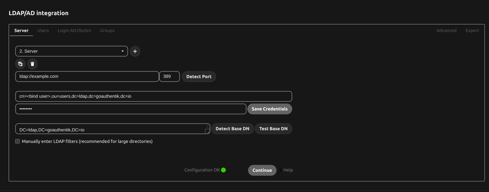
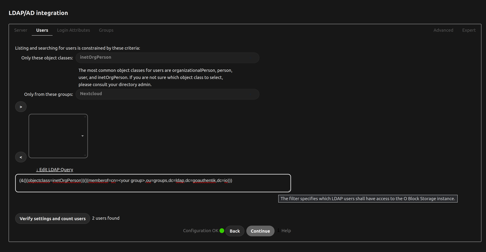
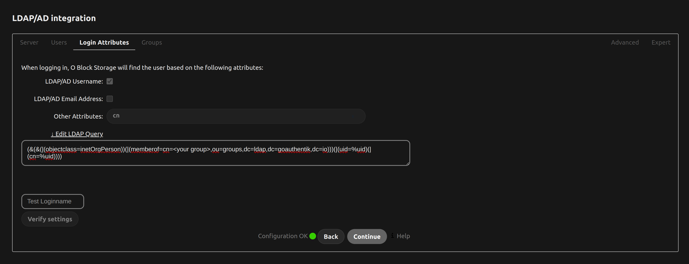
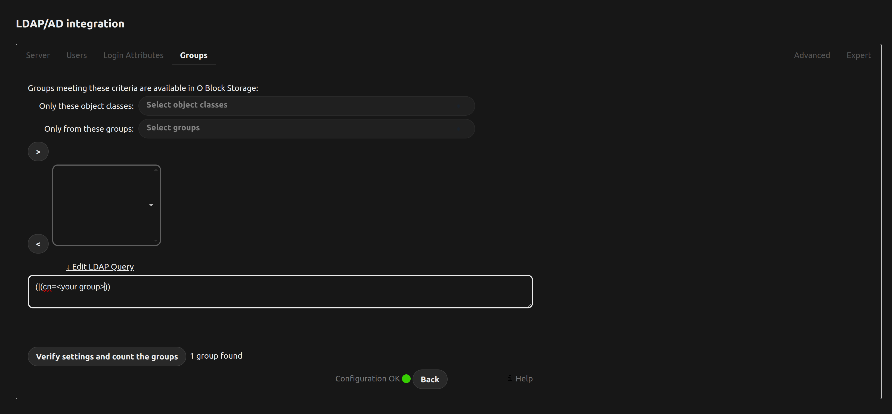
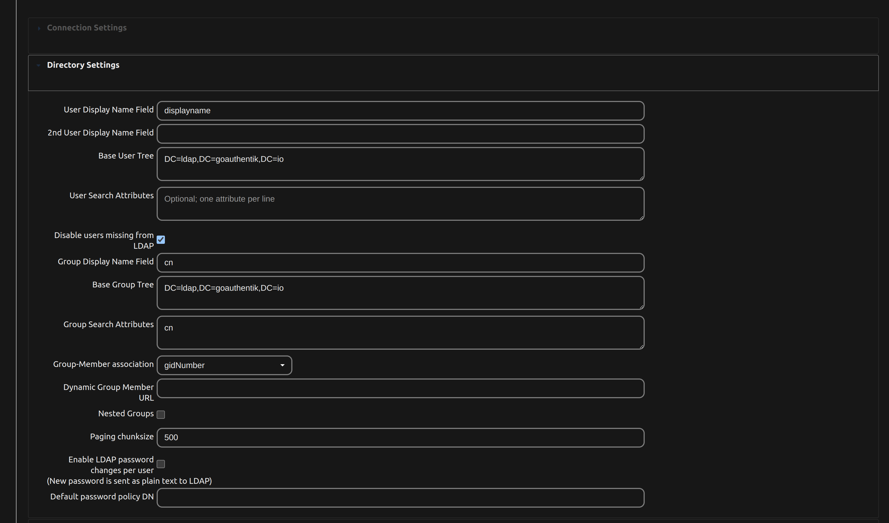
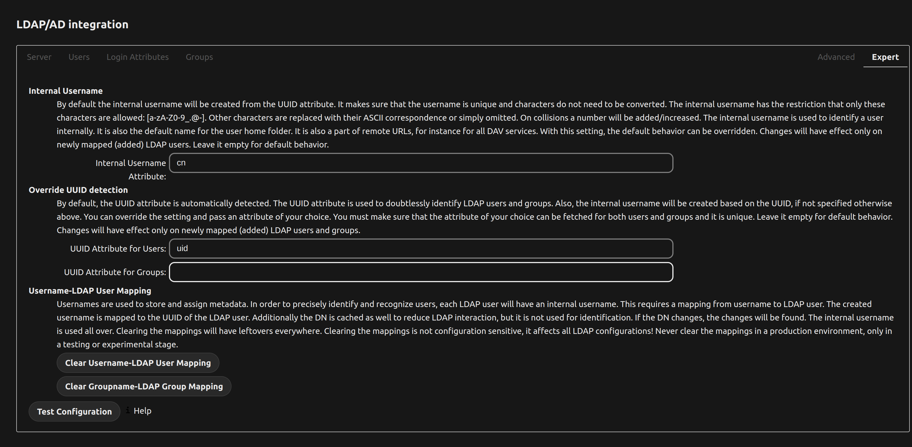
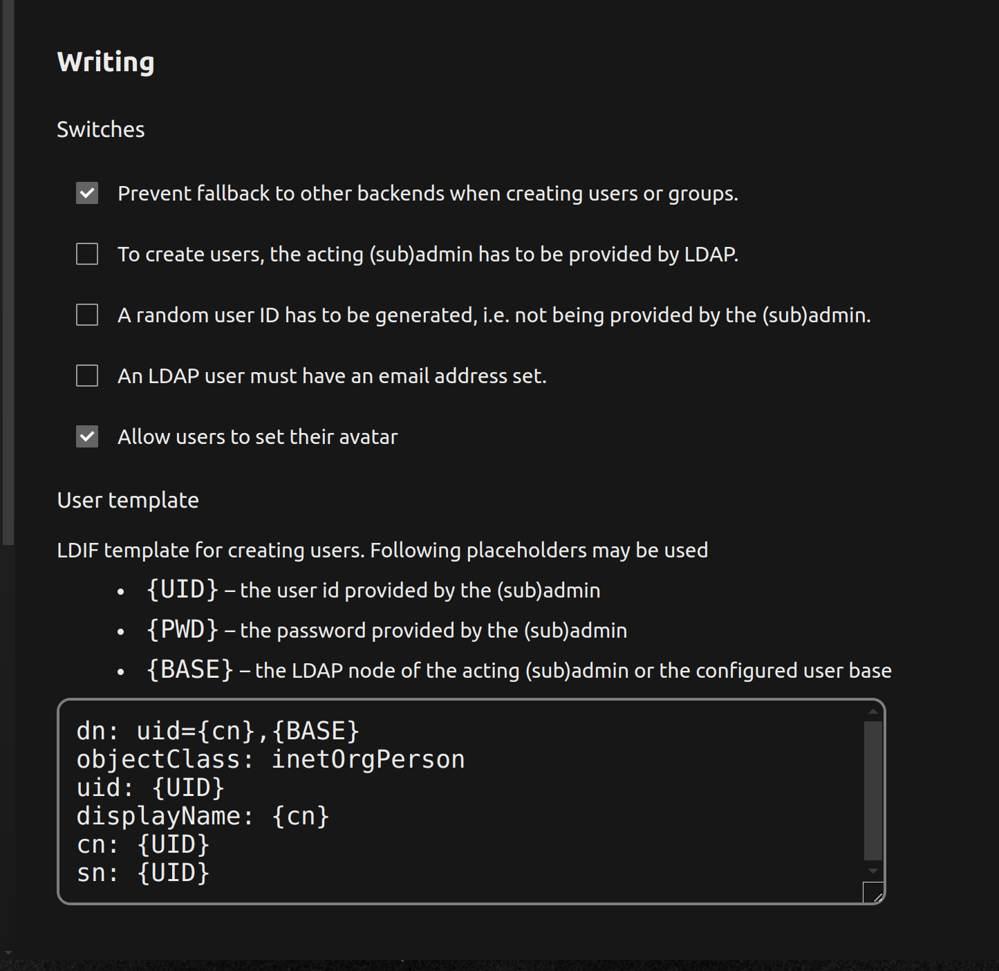

# Nextcloud LDAP/AD Integration Guide

This guide provides step-by-step instructions for integrating  Authentik LDAP/AD with Nextcloud.

## Server Configuration

In the Server tab, configure the LDAP server details:
- Server: `ldap://example.com`
- Port: `389`
- Base DN: `DC=ldap,DC=goauthentik,DC=io`
- User DN: `cn=<bind user>,ou=users,dc=ldap,dc=goauthentik,dc=io`

## Users

In the Users tab, configure:
- Object classes: `inetOrgPerson`
- Groups: `<your group>`

## Login Attributes

In the Login Attributes tab, set the attributes:
- LDAP/AD Username: `cn`
- LDAP Filter: `(&(&(objectclass=inetOrgPerson)(|(memberof=cn=<your group>,ou=groups,dc=ldap,dc=goauthentik,dc=io))(|(uid=%uid)(|(cn=%uid)))))`

## Groups

In the Groups tab, set the group filter:
- LDAP Filter: `(|(cn=<your group>))`

## Directory Settings

In the Directory Settings tab, configure:
- User Display Name Field: `displayname`
- Base User Tree: `DC=ldap,DC=goauthentik,DC=io`
- Group Display Name Field: `cn`
- Base Group Tree: `DC=ldap,DC=goauthentik,DC=io`

## Expert Settings

In the Expert tab, configure:
- Internal Username Attribute: `cn`
- UUID Attribute for Users: `uid`

## Writing Settings

In the Writing tab, configure:
- Prevent fallback to other backends when creating users or groups.
- Allow users to set their avatar.
